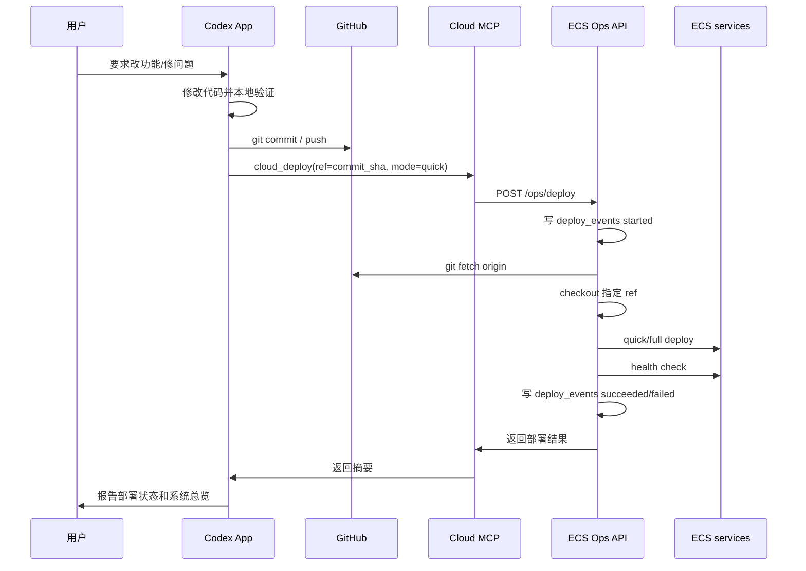

# Cloud Pull Deploy 技术方案

## 给执行 Session 的指令

请按照本文档实现 Cloud Pull Deploy。第一版优先完成：

1. ECS Ops API 增加 `POST /ops/deploy`。
2. MCP 增加 `cloud_deploy(ref, mode, render=True)` 工具。
3. 部署过程写入 `deploy_events`。
4. 部署后运行健康检查，并把摘要写入部署事件。
5. 保持 GitHub Actions 作为备用/正式发布通道，不重构无关部署逻辑。

明确不要做：

- 不要用 `rsync` 作为主线。
- 不要做 GitHub webhook 自动部署。
- 不要引入 Kubernetes、Argo CD、Flux 或其他重型 GitOps 平台。
- 不要改造钉钉交互主链路。
- 不要顺手拆 `command_router.py` 或 `repository.py`。
- 不要改动真实 `.env`、密钥、token、webhook。

第一版验收标准：

- Codex 可以调用 MCP tool `cloud_deploy(ref=<commit_sha>, mode="quick")`。
- ECS 通过 Ops API 从 GitHub 拉取指定 ref 并部署。
- `deploy_events` 能看到 started / succeeded / failed。
- `系统总览` 能显示最近部署状态。
- 部署失败时，返回清晰错误并写入 `deploy_events`。

## 目标

把 InvestmentKnowledge 的日常部署主线调整为：

```text
Codex 本地改代码
  -> 本地验证
  -> git commit / push
  -> Codex 调用 cloud_deploy(ref, mode)
  -> ECS 从 GitHub 拉取指定 commit
  -> quick/full deploy
  -> 健康检查
  -> deploy_events / 系统总览可见
```

这个方案服务于当前最高频工作流：

```text
用户
  -> Codex App
    -> Codex 改代码、验证、push、触发云端部署、检查结果
```

钉钉继续作为日常投资查询和通知入口；GitHub Actions 保留为正式发布、full rebuild 和灾备通道，不再作为高频小改的主部署路径。

## 为什么不用 rsync 作为主线

`rsync` 可以快速把本地源码复制到 ECS，但它的问题是：

- 云上运行代码不一定对应一个明确 Git commit。
- 变更来源是“本地文件状态”，不是 GitHub 事实源。
- 回滚和审计不够自然。
- 长期容易出现“本地、GitHub、云端”三份状态不一致。

`rsync` 可以保留为应急方案，但不作为长期主线。

## 为什么不用 GitHub Actions 作为高频主线

GitHub Actions 适合：

- 依赖变化。
- Dockerfile / 镜像结构变化。
- full rebuild。
- 正式 main 分支发布。
- 灾备重建。

但它不适合当前最高频的 Codex 协作小改：

- 固定成本高：checkout、build、tar、scp、ssh 都耗时。
- 反馈链路远：失败后 Codex 还要再查 Actions 输出和云端日志。
- 小改动过重：只改 Python 业务逻辑也走完整 CI/CD，不够轻。

因此 GitHub Actions 保留为正式发布轨，日常走云端 pull deploy。

## 方案原则

1. GitHub 是代码事实源。
2. ECS 自己拉取指定 commit，而不是接收本地文件推送。
3. Codex 显式触发部署，不做每次 push 自动部署。
4. 部署必须记录到 `deploy_events`。
5. 部署后必须做健康检查。
6. 用户不看 Docker/GitHub 日志；Codex 通过系统总览和事件表判断状态。

## 总体架构

```text
Codex App
  |
  | 1. git push branch / commit
  v
GitHub

Codex App
  |
  | 2. MCP tool: cloud_deploy(ref, mode)
  v
InvestmentKnowledge MCP
  |
  | 3. POST /ops/deploy
  v
ECS Ops API
  |
  +-- deployment lock
  +-- deploy_events started
  +-- git fetch origin
  +-- checkout ref
  +-- deploy_from_local_checkout.sh
  +-- health check
  +-- deploy_events succeeded/failed
```

Mermaid:



## ECS 目录结构

建议保留两个目录：

```text
/opt/investment-knowledge-repo
  GitHub checkout
  只负责拉代码和选择 ref

/opt/investment-ops
  Independent Ops API control plane
  Owns its venv and systemd service

/opt/investment-knowledge
  Business app root
  Keeps .env, shared/, releases/, and current -> releases/<sha>

/opt/investment-knowledge/current
  Active release symlink
  docker compose starts from here
```

Deploy from the repo checkout into a staged release, then atomically update `current`:

```bash
SOURCE_DIR=/opt/investment-knowledge-repo \
APP_ROOT=/opt/investment-knowledge \
BUILD_IMAGE=false \
bash /opt/investment-knowledge-repo/scripts/deploy_from_local_checkout.sh
```

`deploy_from_local_checkout.sh` 已经负责：

- Staging a complete release under `releases/<sha>`.
- Preserving shared drafts under `shared/drafts`.
- Linking the app `.env` into the staged release when present.
- Switching `current` only after the release has the required files.
- Rolling `current` back to the previous release if compose activation fails.
- 重启 `postgres`、`mcp`、`account-snapshot-scheduler`、`ipo-reminder-scheduler`、`dingtalk-stream-bot`
- 写入本地部署事件

后续会让 Ops API 的 deploy 流程统一写 `deploy_events`。

## GitHub 权限

当前 `coolCodeStudy/TurenAgentTool` 仓库可未登录访问，第一版 ECS 直接使用 HTTPS 匿名只读拉取代码：

```text
https://github.com/coolCodeStudy/TurenAgentTool.git
```

因此第一版不需要把 GitHub Actions secrets、个人 GitHub token 或 deploy key 搬到 ECS。

ECS 只需要能访问 GitHub，并在 `/opt/investment-knowledge-repo` 保留一个普通 Git checkout：

```bash
git clone https://github.com/coolCodeStudy/TurenAgentTool.git /opt/investment-knowledge-repo
git -C /opt/investment-knowledge-repo fetch origin
```

如果未来仓库改成 private，再改用 GitHub deploy key。

推荐：

```text
read-only deploy key
仅绑定 TurenAgentTool 仓库
私钥只放 ECS
```

不要把个人 GitHub token 作为主部署凭据。

如果未来需要跨多个仓库，再考虑 GitHub App installation token。

本地 Codex push 认证遵守独立边界：

- 只有在用户明确授权 push 或 deploy 时，才读取本机 GitHub PAT 文件。
- 优先使用 `/Users/lishaocheng/code/github_pat_only`；该文件应只包含 GitHub PAT。
- 旧的 `/Users/lishaocheng/code/github_pat` 只作为兼容兜底；该文件后续行可能包含 Postgres 密码、Command API token 或其他本机秘密，只允许把第一行当作 GitHub PAT。
- 不自动重写、截断、重命名、拆分、清理或打印 `/Users/lishaocheng/code/github_pat_only` 或 `/Users/lishaocheng/code/github_pat`。
- push 时设置 `GIT_CONFIG_NOSYSTEM=1`，避免系统级 `git-credential-osxkeychain` 弹出 Keychain 授权框。
- 只在 `/tmp` 下创建临时 credential store，push 完立即删除。
- 不把 PAT 写入 remote URL、文档、日志、commit message 或聊天摘要。

## 通知云上的方式

不使用 GitHub webhook 作为第一版主线。

原因：

- 不是每次 push 都应该部署。
- Codex 可能会 push 中间状态。
- 有些 commit 需要先验证或等用户确认。
- 显式 `cloud_deploy(ref)` 更可控。

第一版采用：

```text
Codex push 后，主动调用 MCP tool: cloud_deploy
```

底层：

```text
cloud_deploy
  -> Ops API POST /ops/deploy
```

当前缺口（2026-06-16）：

- `/ops/deploy` 在云端会卡在 `record deploy start`，尚未进入 fetch/checkout/deploy；Ops API 只返回 traceback 第一行，诊断信息不足。
- 需要让 Ops API 在部署事件记录失败时返回可行动错误，或将 deploy event 记录降级为 warning 后继续部署并在结果里标注审计缺口。
- GitHub Actions quick deploy 不会重建/重启 `weekly-review-web`，周复盘 Web 修复不能依赖当前 quick deploy；短期走 full deploy，长期应把 `weekly-review-web` 纳入 quick deploy 或明确 quick deploy 适用范围。
- ECS 上 host/systemd 与 Docker container 必须使用不同 DB profile：宿主侧 `127.0.0.1:55432`，容器侧 `postgres:5432`。部署脚本和 compose env 需要防止宿主 `.env` 覆盖容器内连接地址。

Pull-Based Atomic Ops Deploy V2 update:

- The daily deploy mainline is `Codex/MCP -> independent ECS Ops API -> ECS local pull deploy`.
- The Ops control plane lives in `/opt/investment-ops` with its own venv and systemd service; it no longer reads its running script from the mutable business app directory.
- The business app root is `/opt/investment-knowledge`; releases are staged under `/opt/investment-knowledge/releases/<sha>` and activated by switching `/opt/investment-knowledge/current`.
- Quick deploy copies code and recreates compose services without building an image. Full deploy is reserved for dependency/image-layer or production service-structure changes such as `Dockerfile`, `requirements.txt`, or `docker-compose.prod.yml`.
- GitHub Actions remains a secondary/rescue path. The current hosted-runner-to-ECS `:22` failure (`ssh handshake reset by peer`) is documented but no longer blocks daily releases.
- One-time bootstrap uses Alibaba Cloud ECS Cloud Assistant Run Command to install `/opt/investment-ops`, write `/etc/investment-knowledge/ops-api.env`, and start `investment-ops-api.service`.

以后稳定后可加 webhook：

```text
main push -> staging 自动部署
production -> 仍然手动 cloud_deploy
```

## Ops API 接口设计

### POST /ops/deploy

请求：

```json
{
  "ref": "main 或 commit_sha",
  "mode": "quick",
  "source": "codex_app",
  "requested_by": "codex"
}
```

字段：

- `ref`：Git ref，推荐使用 commit SHA。
- `mode`：`quick` 或 `full`。
- `source`：触发来源，例如 `codex_app`、`manual`。
- `requested_by`：触发者。

响应为异步启动结果。真实部署在 ECS 后台继续执行，调用方通过
`GET /ops/deploy-status?id=<deploy_event_id>` 或 `系统总览` 查询最终状态：

```json
{
  "ok": true,
  "data": {
    "deploy_event_id": 123,
    "ref": "abc123",
    "mode": "quick",
    "status": "started",
    "summary": "deployment started",
    "status_url": "/ops/deploy-status?id=123"
  }
}
```

启动失败响应：

```json
{
  "ok": false,
  "error": "deployment is already running",
  "data": {
    "status": "busy"
  }
}
```

### GET /ops/deploy-status

请求：

```text
GET /ops/deploy-status?id=123
```

响应：

```json
{
  "ok": true,
  "data": {
    "id": 123,
    "deploy_mode": "quick",
    "commit_sha": "abc123",
    "status": "succeeded",
    "duration_seconds": 18.4,
    "summary": "quick deploy completed",
    "metadata": {
      "health": {
        "ok": true
      }
    }
  }
}
```

## MCP 工具设计

### cloud_deploy

参数：

```json
{
  "ref": "abc123",
  "mode": "quick",
  "render": true
}
```

行为：

- 调用 Ops API `/ops/deploy` 启动异步部署。
- 立即返回中文摘要。
- 摘要包含 deploy event id、ref、mode、启动状态和状态查询提示。

示例输出：

```text
云端部署已启动：
- deploy_event: #123
- ref: abc123
- mode: quick
- 状态：started

可继续问：cloud_deploy_status 或 系统总览
```

### cloud_deploy_status

参数：

```json
{
  "deploy_event_id": 123,
  "render": true
}
```

行为：

- 调用 Ops API `/ops/deploy-status?id=123`。
- 返回部署事件状态、耗时、摘要和健康检查结果。

## 部署锁

Ops API 必须防止并发部署。

第一版可用文件锁：

```text
/tmp/investment-knowledge-deploy.lock
```

规则：

- 同一时间只允许一个 deploy。
- 如果已有 deploy 在跑，新的请求返回 busy。
- busy 结果也写入或返回明确原因。

## quick/full 模式

### quick

适用于：

- `.py`
- `scripts/*.py`
- `db/schema.sql`
- 文档
- prompt
- shell 脚本

动作：

```text
git fetch / checkout
同步源码
不重建镜像
重启相关服务
健康检查
```

### full

适用于：

- `requirements.txt`
- `Dockerfile`
- `docker-compose.prod.yml` 的镜像结构变化
- Python 依赖变化

动作：

```text
git fetch / checkout
同步源码
docker compose build
重启服务
健康检查
```

第一版可由 Codex 判断 mode；后续可以让 Ops API 根据 changed files 自动判断。

## 健康检查

部署后至少检查：

```text
docker compose ps
Postgres socket
MCP socket 或 /mcp 可达
dingtalk-stream-bot running
account-snapshot-scheduler running
ipo-reminder-scheduler running
```

如果 `COMMAND_API_TOKEN` 和 HTTP profile 可用，可追加：

```text
Command API /health
系统总览
```

健康检查摘要写入 `deploy_events.metadata`。

## deploy_events

当前已新增：

```text
deploy_events
  id
  source
  deploy_mode
  commit_sha
  branch_name
  status
  started_at
  finished_at
  duration_seconds
  summary
  logs_tail
  metadata
```

cloud deploy 需要写：

```text
started
succeeded / failed
duration_seconds
commit_sha
health summary
```

`系统总览` 已读取最近部署记录。

## 实施步骤

### Step 1：ECS repo checkout

- 在 ECS 建 `/opt/investment-knowledge-repo`。
- 由于当前仓库是 public，第一版直接用 HTTPS clone：
  `git clone https://github.com/coolCodeStudy/TurenAgentTool.git /opt/investment-knowledge-repo`。
- 验证 `git fetch origin` 可用。
- 如果未来仓库转 private，再配置 GitHub read-only deploy key。

### Step 2：Ops API 增加部署接口

- 在 `scripts/ecs_ops_api.py` 新增 `POST /ops/deploy`。
- 实现部署锁。
- 实现 git fetch / checkout。
- 调用 `deploy_from_local_checkout.sh`。
- 写 `deploy_events`。

### Step 3：MCP 增加 cloud_deploy

- 在 `investment_knowledge_mcp/ops_client.py` 增加 `deploy_cloud_ref`。
- 在 `investment_knowledge_mcp/server.py` 增加 MCP tool `cloud_deploy`。
- 在 `command_router.py` 可选增加命令 `部署 main`、`部署 <commit>`。

### Step 4：部署后总览

- 部署成功后返回摘要。
- 手动或自动调用 `系统总览`。
- 确认 deploy_events 正常显示。

### Step 5：GitHub Actions 降级

- 保留 full deploy。
- 保留灾备安装。
- quick deploy 可暂时保留，但不再作为高频主线。

## 第一版不做

- 不做 GitHub webhook 自动部署。
- 不做 Kubernetes / Argo CD。
- 不做复杂审批流。
- 不做多环境发布。
- 不做自动回滚。

这些等系统产出和使用频率上来后再考虑。

## 最终判断

当前最优主线是轻量 GitOps：

```text
GitHub = 代码事实源
ECS = pull 指定 commit 并部署
Ops API = 部署控制面
MCP = Codex 调用入口
deploy_events = 部署审计和诊断入口
系统总览 = 用户/Codex 的状态视图
```

这比 rsync 更可追踪，比 GitHub Actions 更快，比 Argo CD 更轻，最符合当前个人云端投资系统和 Codex 协作模式。
