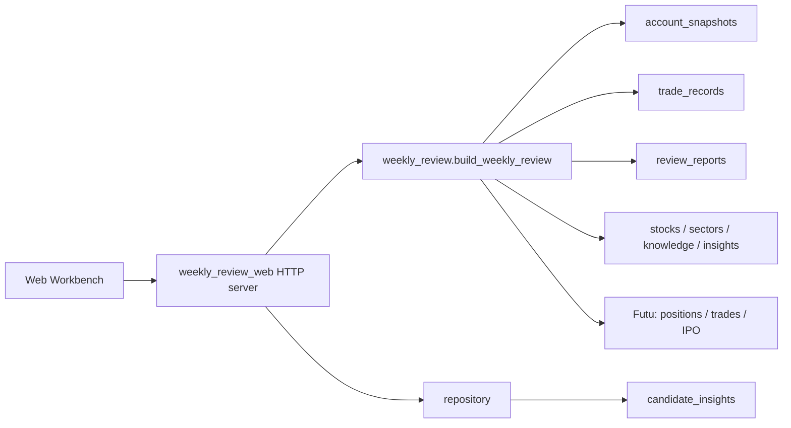

# Weekly Review Web Workbench Technical Plan

## Goal

Implement P0 from `docs/product/周复盘Web工作台产品文档.md`: when the user opens the Web page, the first screen is Weekly Review. The user can select a date range, generate a draft, inspect data source status, review six modules, and save the checked Markdown as the formal weekly review.

The six modules are:

- Highlights.
- Blowups.
- Indexes.
- Overall story.
- Next week outlook.
- Current holdings analysis.

This version does not introduce a frontend build chain. Use a Python standard-library HTTP server for the local workbench, reusing the existing weekly-review service and database tables.

## Scope

Add module:

```text
investment_knowledge_mcp/weekly_review_web.py
```

Reuse:

```text
investment_knowledge_mcp/weekly_review.py
investment_knowledge_mcp/repository.py
db/schema.sql
```

Add configuration:

```text
WEEKLY_REVIEW_WEB_HOST=127.0.0.1
WEEKLY_REVIEW_WEB_PORT=8010
WEEKLY_REVIEW_WEB_TOKEN=
```

When `WEEKLY_REVIEW_WEB_TOKEN` is empty, the server is suitable only for local `127.0.0.1` binding. If exposed to any reachable network, token authentication is required through `Authorization: Bearer ...` or `X-Weekly-Review-Token`. The browser page should provide an access-token input and send it through `Authorization`.

## Architecture



The page only displays and submits the user-edited Markdown. Facts, sorting, status labels, and data gaps are generated by `weekly_review.py`.

## HTTP API

### `GET /weekly-review`

Returns the Weekly Review workbench HTML. The page includes:

- Left navigation.
- Date range selector.
- Data source status bar.
- Six fixed review modules.
- Current-holding filters.
- Markdown draft editor.
- Candidate insight confirmation area.

### `GET /api/weekly-review?start=YYYY-MM-DD&end=YYYY-MM-DD`

Generates a draft and does not save it.

Response:

```json
{
  "ok": true,
  "context": {},
  "markdown": "...",
  "saved_report": null
}
```

### `POST /api/weekly-review/save`

Saves the formal review.

Request:

```json
{
  "start": "2026-06-08",
  "end": "2026-06-14",
  "markdown": "user-edited Markdown"
}
```

The server regenerates the structured context for the same date range, then writes the submitted Markdown to `review_reports.summary`.

### `GET /api/candidate-insights?status=pending`

Returns candidate insights.

### `POST /api/candidate-insights/{id}/confirm`

Confirms a candidate insight and promotes it to `user_insights`.

### `POST /api/candidate-insights/{id}/reject`

Rejects a candidate insight.

## Data Methodology

P0 uses the existing weekly-review methodology:

- Main ledger: `account_snapshots` beginning/end holding `pl_val` delta.
- Explanation ledger: `trade_records` for this week's add, trim, open, and close actions.
- Current holdings: if ending snapshot is missing and the end date covers today, attempt realtime positions as reference.
- IPO: reuse `get_hk_ipo_list()`.
- Indexes and external events: explicitly show as not connected; do not infer or invent them.

Save results to:

```text
review_reports.report_type = weekly
review_reports.period_start
review_reports.period_end
review_reports.summary
review_reports.portfolio_snapshot
review_reports.source_status
review_reports.highlights
review_reports.blowups
review_reports.holdings_table
review_reports.next_week
review_reports.story
```

## Running Locally

```bash
.venv/bin/python -m investment_knowledge_mcp.weekly_review_web
```

Default URL:

```text
http://127.0.0.1:8010/weekly-review
```

The service connects to the current `.env` or default database configuration. The repository default is:

```text
POSTGRES_HOST=localhost
POSTGRES_PORT=55432
POSTGRES_DB=investment_kg
```

## Verification

Narrow checks in `scripts/smoke_test.py` should cover:

- Workbench HTML contains key page structure.
- Date range parsing corrects reversed dates.
- Existing weekly-review generation, save, and command-router paths still pass.

Recommended command:

```bash
.venv/bin/python scripts/smoke_test.py
```

Manual page validation:

1. Start `weekly_review_web`.
2. Open `/weekly-review`.
3. Select date range.
4. Generate review.
5. Check data source status, six modules, and Markdown draft.
6. Edit Markdown and save report.

## Boundaries And Follow-Ups

P0 does not implement:

- Index market data provider.
- Xueqiu/Twitter/X/announcement event source.
- Complex charts.
- Login system.
- Automatic review of last week's outlook.

Suggested P1 order:

1. Add index data into `context.index_summary`.
2. Embed candidate insight generation and confirmation into review save.
3. Save per-item user edits for highlights, blowups, and next-week items.
4. Add historical weekly review list and previous-outlook checkback.
5. Add current holding theme exposure and action queue.
