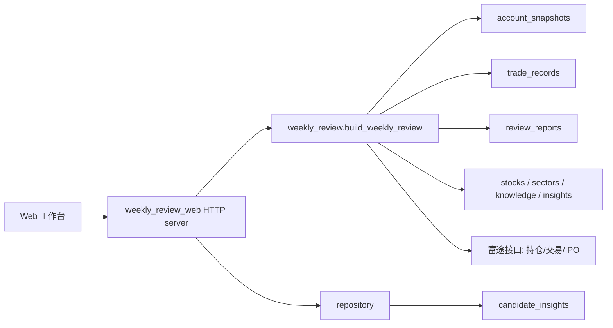

# 周复盘 Web 工作台技术方案

> Status note (2026-06-18): This is the historical P0 Web workbench plan. It remains useful for page layout and module structure, but its arbitrary `start/end` date range, draft/finalized workflow wording, and save semantics are superseded by `docs/techplans/weekly-review-week-scope-force-refresh.md`. Current behavior is fixed natural week, read existing by default, generate only when missing, and force-refresh overwrite of the same weekly report row after confirmation.

## 目标

实现 `docs/product/周复盘Web工作台产品文档.md` 的 P0：用户打开 Web 后第一屏就是“本周复盘”，可以选择日期范围、生成草稿、查看数据源状态、高光/炸裂/指数/整体故事/下周展望/当前持仓分析 6 个模块，并将检查后的 Markdown 保存为正式周复盘。

本版本不引入前端构建链路，使用 Python 标准库 HTTP server 承载本地工作台，复用已有周复盘业务服务和数据库表。

## 实现范围

新增模块：

```text
investment_knowledge_mcp/weekly_review_web.py
```

复用模块：

```text
investment_knowledge_mcp/weekly_review.py
investment_knowledge_mcp/repository.py
db/schema.sql
```

新增配置：

```text
WEEKLY_REVIEW_WEB_HOST=127.0.0.1
WEEKLY_REVIEW_WEB_PORT=8010
WEEKLY_REVIEW_WEB_TOKEN=
```

`WEEKLY_REVIEW_WEB_TOKEN` 为空时适合本地只监听 `127.0.0.1`；部署到可访问网络时必须配置 token，并通过 `Authorization: Bearer ...` 或 `X-Weekly-Review-Token` 调用 API。浏览器页面提供“访问令牌”输入框，填写后会用 `Authorization` 请求 API。

## 架构



页面只负责展示和提交用户编辑后的 Markdown；事实数据、排序、状态标签、数据缺口仍由 `weekly_review.py` 生成。

## HTTP 接口

### `GET /weekly-review`

返回周复盘工作台 HTML。页面包含：

- 左侧导航。
- 日期范围选择。
- 数据源状态条。
- 6 个固定复盘模块。
- 当前持仓筛选。
- Markdown 草稿编辑区。
- 候选心得确认区。

### `GET /api/weekly-review?start=YYYY-MM-DD&end=YYYY-MM-DD`

生成草稿，不保存。

返回：

```json
{
  "ok": true,
  "context": {},
  "markdown": "...",
  "saved_report": null
}
```

### `POST /api/weekly-review/save`

保存正式复盘。请求体：

```json
{
  "start": "2026-06-08",
  "end": "2026-06-14",
  "markdown": "用户编辑后的 Markdown"
}
```

服务端会重新生成同一日期范围的结构化 context，再把用户提交的 Markdown 写入 `review_reports.summary`。

### `GET /api/candidate-insights?status=pending`

读取候选心得列表。

### `POST /api/candidate-insights/{id}/confirm`

确认候选心得，提升为正式 `user_insights`。

### `POST /api/candidate-insights/{id}/reject`

拒绝候选心得。

## 数据口径

当前周复盘口径：

- 主账本：`account_snapshots` 区间首尾持仓 `pl_val` 差分 + `trade_records` 区间卖出实现盈亏估算。
- 解释账本：`trade_records` 本周成交，用于解释加仓、减仓、新开仓、清仓，并参与区间盈亏排名。
- 清仓止盈不会再把周初已有历史浮盈直接当成本周高光；清仓割肉会保留亏损退出信号。
- 当前持仓：如果期末快照缺失且结束日期覆盖今天，尝试读取实时持仓作为期末参考。
- IPO：复用 `get_hk_ipo_list()`。
- 指数和外部事件：明确显示未接入，不允许脑补。

保存结果写入：

```text
review_reports.report_type = weekly
review_reports.period_start
review_reports.period_end
review_reports.summary
review_reports.portfolio_snapshot
review_reports.source_status
review_reports.highlights
review_reports.blowups
review_reports.holdings_table
review_reports.next_week
review_reports.story
```

## 运行方式

本地启动：

```bash
.venv/bin/python -m investment_knowledge_mcp.weekly_review_web
```

默认访问：

```text
http://127.0.0.1:8010/weekly-review
```

服务会连接当前 `.env` 或默认配置指向的数据库。按本仓库默认值，目标是：

```text
POSTGRES_HOST=localhost
POSTGRES_PORT=55432
POSTGRES_DB=investment_kg
```

## 验证

已在 `scripts/smoke_test.py` 增加窄验证：

- Web 首页 HTML 包含工作台关键结构。
- Web 日期范围解析能自动纠正倒置日期。
- 现有周复盘生成、保存和命令路由链路继续通过。

推荐验证命令：

```bash
.venv/bin/python scripts/smoke_test.py
```

如果要人工验证页面：

1. 启动 `weekly_review_web`。
2. 打开 `/weekly-review`。
3. 选择日期范围。
4. 点击“生成复盘”。
5. 检查数据源状态、6 个模块和 Markdown 草稿。
6. 修改 Markdown 后点击“保存报告”。

## 边界和后续

P0 暂不实现：

- 指数行情接入。
- 雪球/Twitter/X/公告事件源。
- 复杂可视化图表。
- 登录系统。
- 下周展望自动回看。

P1 建议顺序：

1. 接入指数行情，补 `context.index_summary`。
2. 候选心得生成和确认流程嵌入周复盘保存后。
3. 保存用户对高光/炸裂和下周事项的逐项编辑。
4. 历史周复盘列表和上周展望回看。
5. 当前持仓主题暴露图和待处理队列。
